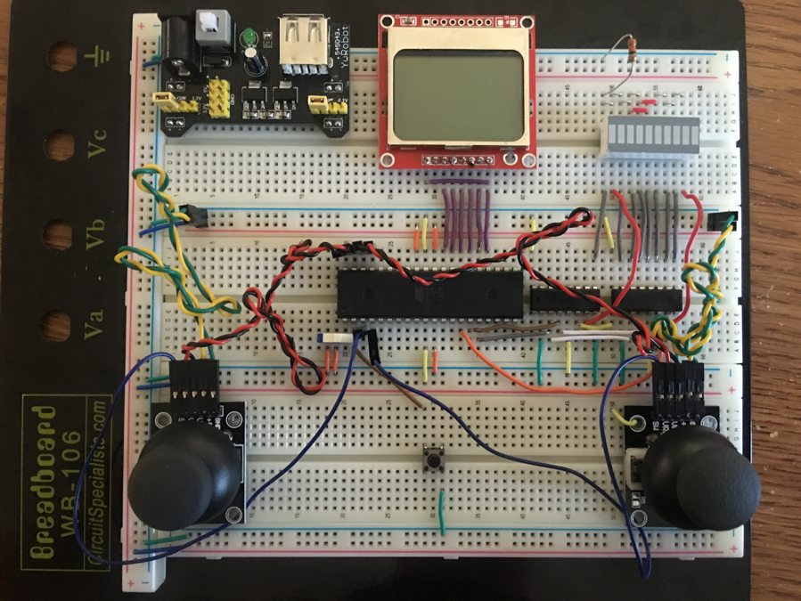
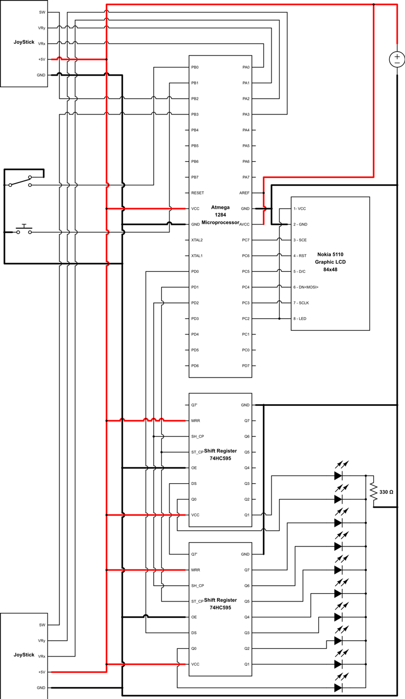

# MagicFight by Leng Zhang

## Introduction
  For this custom lab project, I made a wizard fighting game. Two wizards stand both sides to use magic to attack each other by shooting power ball to each other or to opposite base after destroying opposite towers.

  For implementing this game, I used a ATMEGA 1284-PU microprocessor to control the system, a Nokia 5110 Graphic LCD 84×48 to display the game, two shift registers to control 10 segment LED bar to display the remain time of the game, two Joysticks and a push button to control, and a slide switch to control the game on and off.

## Wiring Setup

## Schema of the System

## Video
[https://youtu.be/rE-MPZEjxwc](https://youtu.be/rE-MPZEjxwc)

## Instruction
1. Players can change character type, power ball type, and timer mode of the game in Setting Menu. The setting will be kept even players turn off the power switch.
2. Pressing and holding the button of Joystick will activate charging mode.
    * Holding more than 1 second and push JoyStick to right then release the button of JoyStick, the character will shoot a normal power ball.
    * Holding more than 2 seconds and push JoyStick to left then release the button of JoyStick, the character will shoot a normal shell.
    * Holding more than 5 seconds and push JoyStick to right then release the button of JoyStick, the character will shoot an overcharging power ball as double normal power ball.
    * Holding more than 5 seconds and push JoyStick to left then release the button of JoyStick, the character will shoot an overcharging shell as double normal shell.
    * Other actions if charging more than 1 second, the character will damage itself.
3. The middle button is used to make choose in Menu or Resume Menu, go back to Menu in Setting Menu, and go to Resume Menu during game.